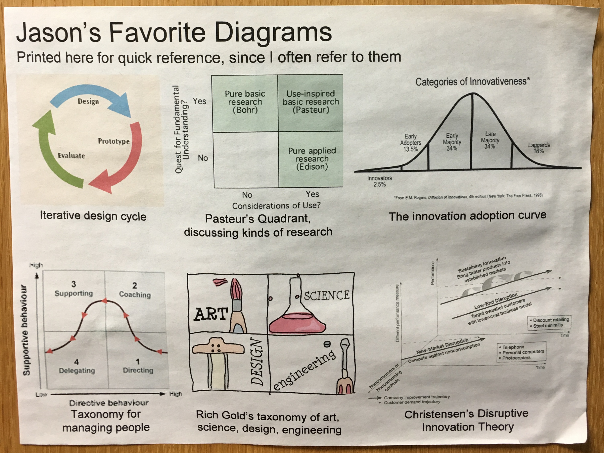
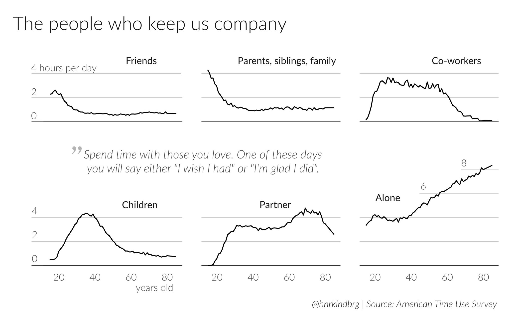

## Hoard these insightful diagrams.

----

Sept. 2, 2017:

Jason's favorite diagrams

Aug. 16, 2017: 

Pasteur's Quadrant: Good science + good applications

June. 15, 2017:

American time use survey

