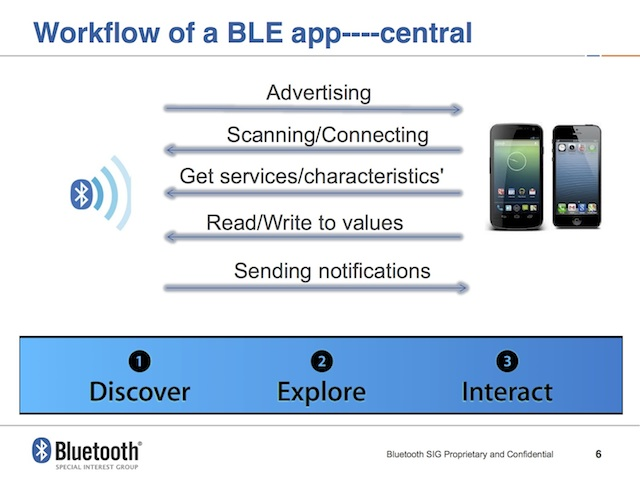

Bluetooth 
==============

** References **

- [BLE master/slave, GATT client/server, and data RX/TX basics](https://bluegiga.zendesk.com/entries/25053373--REFERENCE-BLE-master-slave-GATT-client-server-and-data-RX-TX-basics)  (very nice article)
-  (nice illustration)
- [EE regarding BLE](http://stackoverflow.com/questions/10354613/bluetooth-low-energy-updating-a-characteristic-value-repeatedly)
- [Does android support to act as a peripheral](http://stackoverflow.com/questions/19717902/does-android-kitkat-allows-devices-that-support-bluetooth-le-to-act-as-a-periphe)
- [Core Bluetooth programming Guide](https://developer.apple.com/library/ios/documentation/NetworkingInternetWeb/Conceptual/CoreBluetooth_concepts/CoreBluetoothOverview/CoreBluetoothOverview.html#//apple_ref/doc/uid/TP40013257-CH2-SW1)
- [Bluetooth Low Energy: the best media for sensors and actuators?](http://www.iebmedia.com/index.php?id=8294&parentid=63&themeid=255&hft=67&showdetail=true&bb=1)
- [Can iOS do central and peripheral work on same app at same time?](http://stackoverflow.com/questions/16985891/can-ios-do-central-and-peripheral-work-on-same-app-at-same-time)

Overview
-----------

Work flow
-----------

Comparison
-----------

Android / iOS
-----------

|                                   |    android | ios    |
|-----------------------------------|------------|--------|
| running as a BLE peripheral       |    no      |   yes  |
| running as a BLE center           |    yes     |   yes  |

Thoughout 
-----------
- the iPhone 4S won't accept any lower Conn_Interval values than 0x0f. 
- Conn_Interval = 0x000f = 18.75 ms (Apple's hardware guideline claimed it at 20ms)
- 20 bytes * 50 hz * 8 = 8 kbit/s (disable callback)

Distance calculation 
-----------

- [monitoring distance between two moving objects](http://electronics.stackexchange.com/questions/61957/monitoring-distance-between-two-moving-objects)
- [Options for short range distance determination between two objects](http://electronics.stackexchange.com/questions/33110/options-for-short-range-distance-determination-between-two-objects)
- [Using Bluetooth for Short-Term Ad Hoc Connections Between Moving
Vehicles: A Feasibility Study](http://koala.ece.rice.edu/pubs/Mur2002May5UsingBluet.pdf)
- [Fuzzy locating system](http://en.wikipedia.org/wiki/Fuzzy_locating_system)

Connecting
-----------
A slave(server/prepheral) may only be connected to a single master, but a master may be connected to multiple slaves. (up to 8)

The BLE protocol specification requires that the maximum data payload size for these operations is 20 bytes, or in the case of read operations, 22 bytes. BLE is built for low power consumption, for infrequent short-burst data transmissions. Sending lots of data is possible, but usually ends up being less efficient than classic Bluetooth when trying to achieve maximum throughput.

Questions:
-----------

Is it interpolation only? Or some added filtering? 

Is it based on a preconfigured stationary setup of BLE components or do they support moving BLE units? 

How many units can move? Does precision improve if you use 8 BLE devices, not just 4? What's the frame rate? Who does the computation? Only the receiver? Or does the user's device send something out and they use it to stabilize the signal? What's the protocol? Who does and sends what and when? Is it the same as RSSI-based tracking? Is it more or less precise?

- - -

